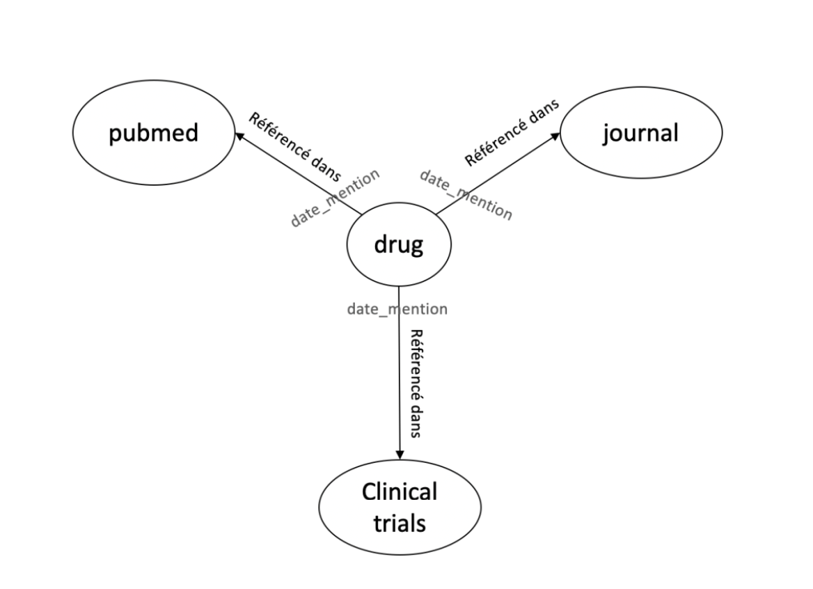

# Création d'un data pipeline
Etant donné les 4 fichiers suivants :
- drugs.csv : contient les noms de drugs (des médicaments) avec un id (atccode) et un nom (drug)
- pubmed.csv : contient des titres d’articles PubMed (title) associés à un journal (journal) à une date donnée (date) ainsi qu’un id (id)
- pubmed.json : même structure que pubmed.csv mais en format JSON
- clinical_trials.csv : contient des publications scientifiques avec un titre (scientific_title), un id (id), un journal (journal) et une date (date).

Générer un fichier json représentant un graphe de liaison entre les différents médicaments et leurs mentions respectives dans les différentes publications PubMed, les différentes publications scientifiques et enfin les journaux avec la date associée à chacune de ces mentions

